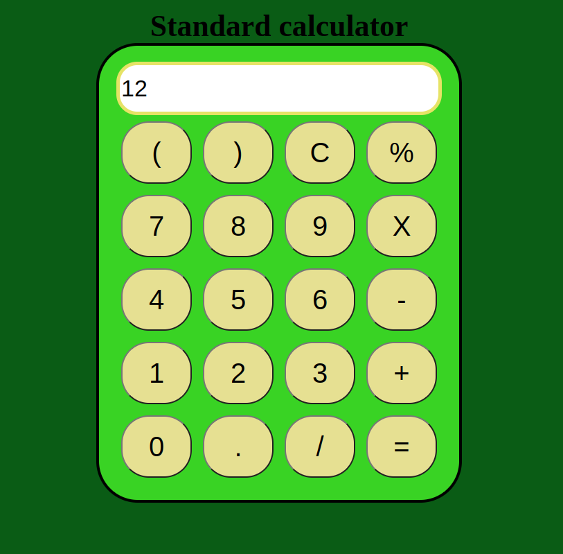

# Design of a Standard Calculator

## AIM:

To design a web application for a standard calculator.

## DESIGN STEPS:

### Step 1:
Fork the repository in your github and Clone the repository from the github.

### Step 2:
Create a django environment.

### Step 3:

Make necessary changes in setting.py and create a static folder.

### Step 4:
Add html,css,and Js files in static folder.

### Step 5:
Run the static files.

### Step 6:

Validate the HTML and CSS code.

### Step 7:

Publish the website in the given URL.

## PROGRAM :
### Calc.html
```html
<!DOCTYPE html>
<html lang="en">

<head>
    <meta charset="UTF-8">
    <meta name="viewport" content="width=device-width, initial-scale=1.0">
    <meta http-equiv="X-UA-Compatible" content="ie=edge">
    <link rel="stylesheet" href="style.css">
    <title>Calculator</title>
</head>

<body>
    <div class="container">
        <div class="title">Standard calculator</div>

        <div class="calculator">
            <input type="text" name="screen" id="screen">
            <table>
                <tr>
                    <td><button>(</button></td>
                    <td><button>)</button></td>
                    <td><button>C</button></td>
                    <td><button>%</button></td>
                </tr>
                <tr>
                    <td><button>7</button></td>
                    <td><button>8</button></td>
                    <td><button>9</button></td>
                    <td><button>X</button></td>
                </tr>
                <tr>
                    <td><button>4</button></td>
                    <td><button>5</button></td>
                    <td><button>6</button></td>
                    <td><button>-</button></td>
                </tr>
                <tr>
                    <td><button>1</button></td>
                    <td><button>2</button></td>
                    <td><button>3</button></td>
                    <td><button>+</button></td>
                </tr>
                <tr>
                    <td><button>0</button></td>
                    <td><button>.</button></td>
                    <td><button>/</button></td>
                    <td><button>=</button></td>
                </tr>
            </table>
        </div>
    </div>

</body>
<script src="calc.js"></script>
```
### Calc.css
```css 
body{
    background-color: rgb(10, 92, 21);
}

.container{
    text-align: center;
    margin-top:23px
}
.title{
    font-family: Georgia, 'Times New Roman', Times, serif;
    font-size: 5vh;
    font-weight: bolder;
}
table{
    margin: auto;
}

input{
    border-radius: 30px;
    border: 5px solid #e6e366;
    font-size:34px;
    height: 65px;
    width: 456px;
}

button{
    border-radius: 40px;
    font-size: 40px;
    background: rgb(230, 224, 146);
    width: 102px;
    height: 90px;
    margin: 6px;
}

.calculator{ 
    border: 4px solid #000000;
    background-color: #39d324 ;
    padding: 23px;
    border-radius: 60px;
    display: inline-block;
    
}

h1{
    font-size: 28px;
    font-family: 'Courier New', Courier, monospace;
}
```
### Calc.js
```js
let screen = document.getElementById('screen');
buttons = document.querySelectorAll('button');
let screenValue = '';
for (item of buttons) {
    item.addEventListener('click', (e) => {
        buttonText = e.target.innerText;
        console.log('Button text is ', buttonText);
        if (buttonText == 'x') {
            buttonText = '*';
            screenValue += buttonText;
            screen.value = screenValue;
        }
        else if (buttonText == 'C') {
            screenValue = "";
            screen.value = screenValue;
        }
        else if (buttonText == '=') {
            screen.value = eval(screenValue);
        }
        else {
            screenValue += buttonText;
            screen.value = screenValue;
        }

    })
}
```
## OUTPUT:


## Result:
Thus The simple calculator had created successfully.
